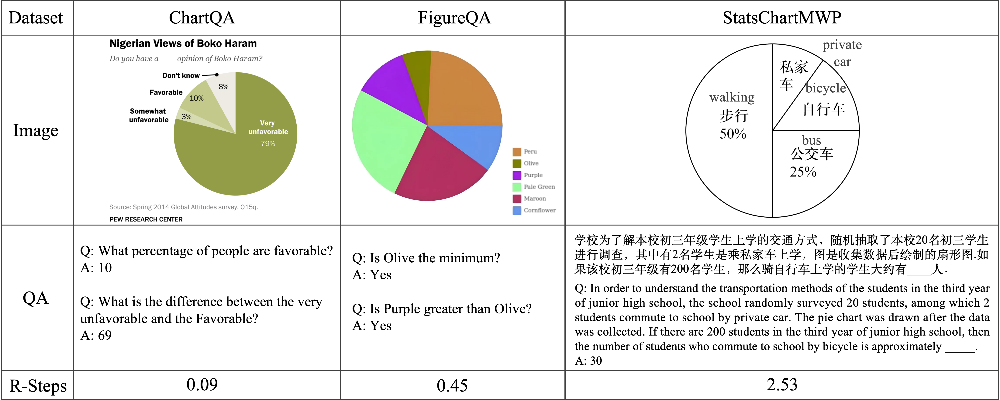
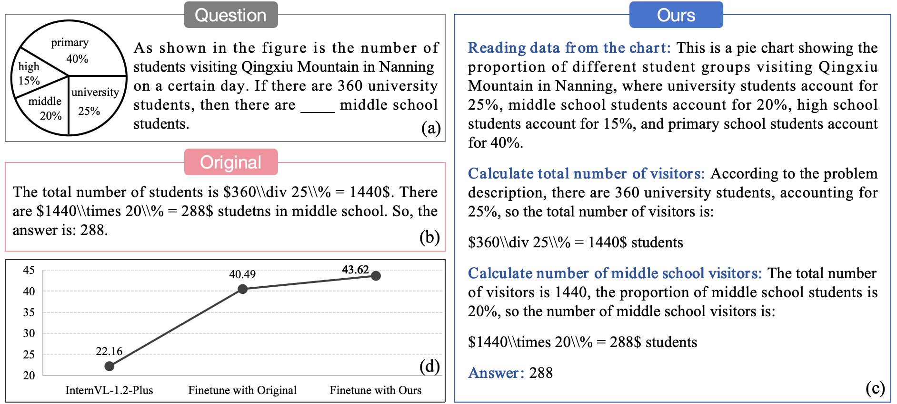

# StatsChartMWP

 
 

 


<!-- 🌟  This is the official repository for the paper "[StatsChartMWP: A Dataset for Evaluating Multimodal Mathematical Reasoning Abilities on Math Word Problems with Statistical Charts](https://arxiv.org/pdf/xxx.pdf)" -->

This is the official repository for the paper "StatsChartMWP: A Dataset for Evaluating Multimodal Mathematical Reasoning Abilities on Math Word Problems with Statistical Charts", the paper link is coming soon.

 <!-- [[📖 Paper](https://arxiv.org/pdf/xxx.pdf)] [[🤗 Huggingface Dataset](https://huggingface.co/datasets/xxx)] -->
 


## 🏆 Leaderboard

The leaderboard is continuously being updated. If you have any new results to contribute, please feel free to reach out to us.

| **#** | **Model** | **Method**| **Date** | **ALL** | **Bar** | **Hist** | **Line** | **Line-f** | **Scatter** | **D-axis** | **P-bar** | **Pie** | **Table** | **Comp** | **Radar** |
| ----------- | ---------------------- | ------------------------ | -------------- | ------------- | ------------- | -------------- | --------------- | --------------- | -------------- | ------------- | --------------- | --------------- | ------------- | --------------- | -------------- |
| 1 | Qwen2-VL-72B | LMM | 2024-11-01 | 59.33 | 69.91 | 39.29 | 60.03 | 46.44 | 43.75 | 62.50 | 59.09 | 65.78 | 77.12 | 50.39 | 62.50 | 
| 2 | GPT-4o	| LMM | 2024-11-01 | 57.05 | 66.51 | 26.38 | 58.76 | 42.26 | 45.62 | 68.75 | 54.55 | 72.57 | 81.54 | 49.50 | 45.83 | 
| 3 | GPT4 (GPT-4o) | LLM | 2024-11-01 | 46.95 | 59.98 | 13.30 | 52.72 | 35.98 | 27.50 | 45.31 | 27.27 | 59.19 | 71.85 | 38.82 | 20.83 | 
| 4 | InternVL2-Llama3-76B | LMM | 2024-11-01 | 45.02 | 58.81 | 24.58 | 50.43 | 35.98 | 43.12 | 42.19 | 13.64 | 48.08 | 57.38 | 35.37 | 29.17 | 
| 5 | Qwen2-VL-7B | LMM | 2024-11-01 | 37.46 | 45.67 | 20.16 | 39.29 | 30.96 | 31.25 | 65.62 | 36.36 | 44.54 | 51.25 | 25.70 | 62.50 | 
| 6 | GPT-4V | LMM | 2024-11-01 | 34.28 | 38.57 | 12.10 | 40.48 | 28.87 | 30.00 | 39.06 | 18.18 | 38.25 | 55.67 | 27.89 | 33.33  | 
| 7 | LLaVA-OV-72B | LMM | 2024-11-01 | 32.39 | 38.33 | 15.26 | 39.80 | 30.54 | 35.62 | 42.19 | 31.82 | 34.32 | 45.97 | 22.91 | 16.67 |
| 8 | GPT4 (GPT-4V) | LLM | 2024-11-01 | 31.47 | 38.11 | 8.61 | 39.12 | 22.18 | 20.62 | 35.94 | 4.55 | 34.71 | 52.46 | 24.36 | 20.83 | 
| 9 | IXC-2.5-7B | LMM | 2024-11-01 | 22.55 | 31.10 | 7.36 | 29.25 | 17.99 | 18.75 | 43.75 | 18.18 | 24.88 | 29.72 | 15.02 | 41.67 | 
| 10 | Cambrian-34B | LMM | 2024-11-01 | 18.15 | 22.03 | 8.77 | 27.89 | 14.23 | 18.75 | 46.88 | 22.73 | 16.52 | 20.24 | 14.02 | 41.67 |
| 11 | LLaVA-NeXT-34B | LMM | 2024-11-01 | 15.67 | 20.96 | 5.45 | 23.13 | 13.39 | 20.00 | 25.00 | 4.55 | 14.06 | 19.24 | 12.44 | 20.83 | 
| 12 | DeepSeek-VL-7B | LMM | 2024-11-01 | 13.20 | 16.06 | 4.63 | 21.43 | 11.72 | 12.50 | 28.12 | 4.55 | 14.16 | 15.47 | 9.78 | 8.33 |


## 📐 StatsChartMWP Dataset

The StatsChartMWP dataset is designed as a benchmark to develop AI models capable of understanding multimodal information present in math word problems with statistical charts. Our dataset incorporates a variety of chart forms, presenting a broad visual spectrum and mathematical knowledge competencies and each item originates from real-world educational contexts, encompassing challenges formulated by mathematics educators, genuine student inquiries, and historical examination questions. The StatsChartMWP dataset encompasses 8,514 unique MWPs with statistical charts. The StatsChartMWP dataset contains 11 different types of statistical charts, including bar, line, line-function, dual-axis, pie, composite, radar, histograms, scatter, percentage-bar, tables. A comparative example between our dataset and ChartQA and FigureQA is shown below. R-Steps means the average reasoning steps of the dataset.



The **StatsChartMWP** dataset json file and images are provided in [`data`]. 
<!-- Images you can download from the [🤗 Huggingface](https://huggingface.co/datasets/xxx). -->
<!-- For more details, You can refer to our paper [`here`](https://arxiv.org/pdf/xxx.pdf) -->


## 🌟 CoTAR

### Introduction
We introduce CoTAR, a data augmentation strategy that utilizes CoT augmented reasoning to alleviate the cross-modal alignment between representations of visual mediums of artificial figures and technical language and equations. Specifically, instead of directly using the concise textual solutions of the MWPs, we use the state-of-the-art LLM, so convert them into detailed step-by-step explanations in a CoT-alike format to improve their logical clarity. Furthermore, each step is made up of a short step summary that explicitly states the purpose of this step and a concrete reasoning response. The step summary serves as a guiding directive for the logical analysis or computation required in the current step, while the concrete reasoning response provides a detailed explanation of the process undertaken in response to the step summary. The architecture of our method illustrated in follow:

<p align="center">
     <br>
  An illustration of CoTAR. (a) the original MWP with statistical chart. (b) the corresponding original solution. (c) the solution of CoTAR. The bold words are the step summaries and the following sentences are reasoning responses.
</p>

We conducted fine-tuning on [`Qwen2-VL-7B`](https://github.com/QwenLM/Qwen2-VL). By employing both problem-original solution pairs and problem-augmented solution pairs on our proprietary training dataset, we achieved a 8.76\% improvement in algorithmic accuracy.


### Quick Start

#### Finetune
Finetune the Qwen2-VL-7B, you can see the official GitHub repository of [`Qwen2-VL-7B`](https://github.com/QwenLM/Qwen2-VL).


#### CoTAR
the prompt of CoTAR is provided in [`prompts`](https://github.com/ai4ed/StatsChartMWP/tree/main/prompts). You can run the main code to get the CoTAR solution data.
```shell
python main.py
```


## License

[](https://lbesson.mit-license.org/)

This work is marked with [CC0 1.0](https://creativecommons.org/publicdomain/zero/1.0/)


<!-- ## 📝 Citation

If you find this datasets useful in your research, please consider citing this BibTex:

```
@misc{xxx
}
``` -->


## Related Work

Explore our additional research on **Vision-Language Large Models**, focusing on multi-modal LLMs and mathematical reasoning:

- **[ChartQA]** [ChartQA: A Benchmark for Question Answering about Charts with Visual and Logical Reasoning](https://github.com/vis-nlp/ChartQA)
- **[TABMWP]** [DYNAMIC PROMPT LEARNING VIA POLICY GRADIENT FOR SEMI-STRUCTURED MATHEMATICAL REASONING](https://github.com/lupantech/PromptPG)
- **[MathVista]** [MathVista: Evaluating Mathematical Reasoning of Foundation Models in Visual Contexts](https://github.com/lupantech/MathVista)
- **[MathVerse]** [MathVerse: Does Your Multi-modal LLM Truly See the Diagrams in Visual Math Problems?](https://github.com/ZrrSkywalker/MathVerse)
- **[MATH-Vision]** [Measuring Multimodal Mathematical Reasoning with the MATH-Vision Dataset](https://github.com/mathvision-cuhk/MathVision)
- **[OlympiadBench]** [OlympiadBench: A Challenging Benchmark for Promoting AGI with Olympiad-Level Bilingual Multimodal Scientific Problems](https://github.com/OpenBMB/OlympiadBench)
- **[InternVL]** [InternVL: Scaling up Vision Foundation Models and Aligning for Generic Visual-Linguistic Tasks](https://github.com/OpenGVLab/InternVL)
- **[LLaVA]** [LLaVA: Large Language and Vision Assistant](https://github.com/haotian-liu/LLaVA)

