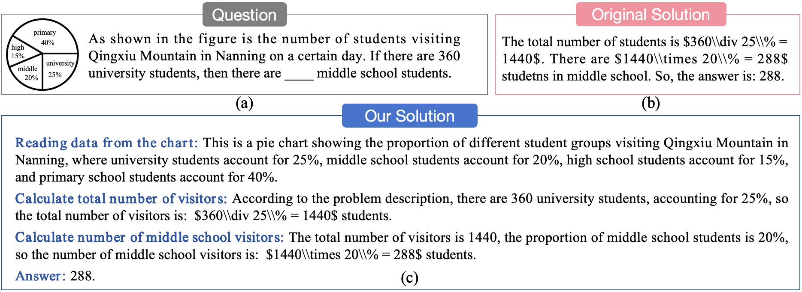

# StatsChartMWP

 
 

 


🌟  This is the official repository for the paper "[StatsChartMWP: A Dataset for Evaluating Multimodal Mathematical Reasoning Abilities on Math Word Problems with Statistical Charts](https://arxiv.org/pdf/xxx.pdf)"

 [[📖 Paper](https://arxiv.org/pdf/xxx.pdf)] [[🤗 Huggingface Dataset](https://huggingface.co/datasets/xxx)]
 

## 🏆 Leaderboard

The leaderboard is continuously being updated. If you have any new results to contribute, please feel free to reach out to us.

| **#** | **Model**        | **Method**| **Date** | **ALL** | **Bar** | **Hist** | **Line** | **Line-f** | **Scatter** | **D-axis** | **Contour** | **Pie** | **Table** | **Comp** | **Radar** |
| ----------- | ---------------------- | ------------------------ | -------------- | ------------- | ------------- | -------------- | --------------- | --------------- | -------------- | ------------- | --------------- | --------------- | ------------- | --------------- | -------------- |
| 1           | GPT-4o                 | LMM         | 2024-06-04     |   55.62    |     65.53    |     23.87    |     58.08    |     43.51    |     43.12    |     51.56    |     36.36    |     71.39    |     79.69    |     49.94    |     41.67    |   
| 2           | GPT4(GPT-4o)            | LLM       | 2024-06-04     | 46.95    |     59.98    |     13.30    |     52.72    |     35.98    |     27.50    |     45.31    |     27.27    |     59.19    |     71.85    |     38.82    |     20.83    |   
| 3           | GPT-4V            | LMM       | 2024-06-04     | 34.28     |    38.57     |    12.10     |    40.48     |    28.87     |    30.00     |    39.06     |    18.18     |    38.25     |    55.67     |    27.89     |    33.33 |
| 4           | GPT4(GPT-4V)            | LLM       | 2024-06-04     | 31.47    |     38.11    |     8.61    |      39.12    |     22.18    |     20.62    |     35.94    |     4.55    |      34.71    |     52.46    |     24.36    |     20.83    |   
| 5           | Qwen-VL-MAX            | LMM       | 2024-06-04     | 30.24    |     37.40    |     10.19    |     29.51    |     19.25    |     20.00    |     29.69    |     18.18    |     37.86    |     54.74    |     16.91    |     33.33    |    


## 📐 StatsChartMWP Dataset

The StatsChartMWP dataset is designed as a benchmark to develop AI models capable of understanding multimodal information present in math word problems with statistical charts. Our dataset incorporates a variety of chart forms, presenting a broad visual spectrum and mathematical knowledge competencies and each item originates from real-world educational contexts, encompassing challenges formulated by mathematics educators, genuine student inquiries, and historical examination questions. The StatsChartMWP dataset encompasses 8,514 unique MWPs with statistical charts. The StatsChartMWP dataset contains 11 different types of statistical charts, including bar/line/line-function/dual-axis/pie/composite/radar/histograms/scatter/contour-maps/tables. A comparative example between our dataset and ChartQA and FigureQA is shown below.


The **StatsChartMWP** dataset json file is provided in [`data`](https://github.com/ai4ed/StatsChartMWP). 
Images you can download from the [🤗 Huggingface](https://huggingface.co/datasets/xxx).
For more details, You can refer to our paper [`here`](https://arxiv.org/pdf/xxx.pdf)


## 🌟 Augmentation of Mathematical Solutions

### Introduction
We introduce an augmented approach, grounded in mathematical solutions, intended for the facilitation of LMMs mathematical reasoning. We posit that comprehensive and methodical solutions are more readily comprehensible and learnable. Consequently, we have expanded the original solutions at a step-by-step level to enhance the logical clarity of the solution process. Each step in our expanded solution scheme is structured in an "instruction: response" format. The instruction serves as a guiding directive for the logical analysis or computation required in the current step, while the response provides a detailed explanation of the process undertaken in response to the instruction. Recognizing that visual data from images is often insufficiently explained in the responses, our approach necessitates the preliminary output of detailed visual information. The architecture of our method illustrated in follow:

<p align="center">
     <br>
  Overview of our augmentation of mathematical solutions mothod. (a) is the input question; (b) is the original solution of the input question; (c) is the augmentation solution of our method; (d) is the accuracy of open-source InternVL-1.2-Plus, finetuned with (b) solution, finetuned with (c) solution, respectively.
</p>

We conducted fine-tuning on [`InternVL-Chat-V1-2-Plus`](https://github.com/OpenGVLab/InternVL). By employing both problem-original solution pairs and problem-augmented solution pairs on our proprietary training dataset, we achieved a 3.13\% improvement in algorithmic accuracy.


### Quick Start
Coming soon


## License
xxx


## 📝 Citation

If you find this datasets useful in your research, please consider citing this BibTex:

```
@misc{xxx
}
```


## Related Work

Explore our additional research on **Vision-Language Large Models**, focusing on multi-modal LLMs and mathematical reasoning:

- **[MathVista]** [MathVista: Evaluating Mathematical Reasoning of Foundation Models in Visual Contexts](https://github.com/lupantech/MathVista)
